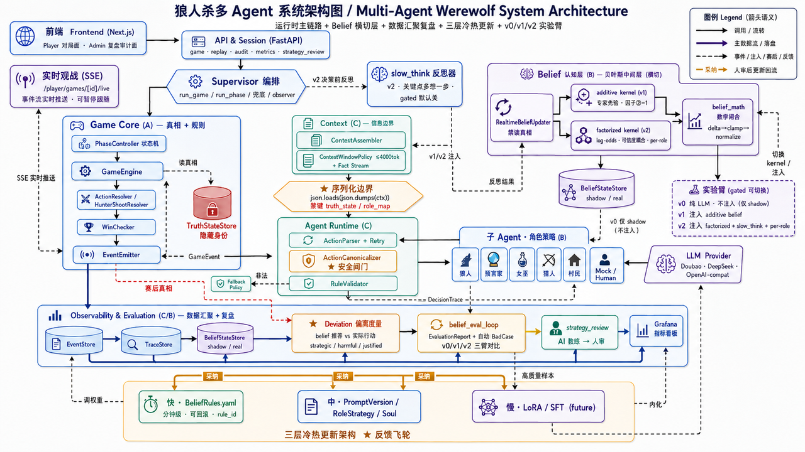

# AI Werewolf Multi-Agent Experiment Platform

This project won the Excellence Award in the ByteDance AI Full-Stack Challenge.



[中文说明](README.zh-CN.md)

AI Werewolf is a multi-agent experiment platform for imperfect-information social deduction games. It lets multiple LLM agents play Werewolf under strict information isolation, while recording each decision's context, prompt, belief state, action, and outcome for audit, replay, evaluation, and strategy iteration.

Core experiment tracks:

- `v0`: pure LLM decisions, with shadow belief maintained for post-game analysis.
- `v1`: additive belief injected into each agent's context.
- `v2`: factorized belief plus slow-think reflection.

## Features

- Standard 9-player Werewolf game: 3 werewolves, seer, witch, hunter, and 3 villagers.
- Strict information isolation: agents only receive serialized visible context, not hidden truth or engine internals.
- Role-specific prompts and strategies for all major roles.
- Advanced strategy snippets for situations such as seer clashes, being accused, tie revotes, witch save/poison, and hunter shot.
- Structured event logs, decision traces, belief states, replay truth, and batch reports.
- Human-in-the-loop games: one human player can join an AI game.
- Live spectator and replay views through the frontend.
- Audit views for timeline, belief, context, decisions, errors, network, and raw data.
- Strategy review generation over batches of games.
- Metrics endpoints for external visualization tools.

## Capabilities

| Capability | Implementation |
|---|---|
| Observability | Structured event stream, decision traces, and belief state storage |
| Evaluation | Shadow belief, belief signal metrics, and v0/v1/v2 batch comparison |
| Replay | Replay UI, belief curves, suspicion network, and audit views |
| Iteration | Prompt versioning and strategy review drafts |

## Architecture

The system is organized into six layers:

Frontend -> API/Session -> Game Core -> Supervisor/Context -> Agent Runtime/Policy -> Observability/Evaluation

The core boundary is simple:

- `game_core/` owns truth and rules.
- `supervisor/` owns orchestration.
- `context/` owns visibility and context assembly.
- `agent_runtime/` owns LLM calls, parsing, canonicalization, and fallback.
- `agent_policy/` owns role behavior, prompt policy, belief updates, and strategy logic.
- `stores/`, `evaluation/`, and `api/` expose persistence, analysis, and service endpoints.

## Quick Start

Requirements: Python 3.12+.

```bash
# 1. Clone and enter the repository
git clone <repo-url> && cd ai_wolf

# 2. Create a virtual environment
python -m venv .venv
source .venv/bin/activate

# 3. Install dependencies
pip install -r requirements-dev.txt

# 4. Create a local environment file from the template
cp .env.example .env

# 5. Run one mock game without LLM credentials
python scripts/start_game.py --mode mock --player-count 9 --arm v0 --seed 0

# 6. Start the backend API
uvicorn api.main:app --reload

# 7. Start the frontend
cd frontend && npm install && npm run dev
```

Default local services:

- Backend API: `http://localhost:8000`
- Frontend: `http://localhost:3000`

## Docker

Build and run the backend:

```bash
docker build -t ai_wolf:0.1 .

docker run -d --name ai_wolf --restart=always \
  -p 8000:8000 \
  --env-file .env \
  -v /var/lib/ai_wolf/data:/data \
  ai_wolf:0.1
```

Build and run the frontend:

```bash
cd frontend
docker build \
  --build-arg NEXT_PUBLIC_API_BASE_URL=http://<api-host>:8000 \
  -t ai_wolf_frontend:latest .

docker run -d --name ai_wolf_frontend --restart unless-stopped \
  -p 127.0.0.1:3000:3000 ai_wolf_frontend:latest
```

## Configuration

All runtime configuration is provided through environment variables. The repository only includes `.env.example` as a template and does not include real secrets or private endpoints.

```bash
cp .env.example .env
```

Mock and fake modes do not require real LLM credentials. To use real models, fill in the provider-specific values in your local `.env`. The `.env` file is ignored by Git.

## Running Games

```bash
# Mock games
python scripts/start_game.py --mode mock --player-count 9 --arm v0 --seed 0
python scripts/start_game.py --mode mock --player-count 9 --games 10 --seed 0

# Real LLM games
python scripts/start_game.py --mode llm --arm v0 --player-count 9
python scripts/start_game.py --mode llm --arm v1 --model-flavor PRO --temperature 0.7

# Batch runs
python scripts/run_batch.py --arm v0 --games 10 --concurrency 5 --model-flavor DEEPSEEK
python scripts/run_batch.py --arm v1 --games 10 --concurrency 5
python scripts/run_batch.py --arm v2 --games 10 --concurrency 5
```

Additional scripts in `scripts/` support v0 batch runs, mixed belief experiments, replay export, and strategy review generation.

## Reproducing Experiments

For paper reviewers, the main reproducibility entry points are the batch runners. First run the mock smoke test in Quick Start to verify the local environment. Then configure a real LLM provider in your local `.env` and run the same seed ranges for each arm you want to compare.

```bash
# Main v0/v1/v2 comparison
python scripts/run_batch.py --arm v0 --games 30 --seed-start 0 --concurrency 5 --model-flavor DEEPSEEK
python scripts/run_batch.py --arm v1 --games 30 --seed-start 0 --concurrency 5 --model-flavor DEEPSEEK
python scripts/run_batch.py --arm v2 --games 30 --seed-start 0 --concurrency 5 --model-flavor DEEPSEEK

# Mixed belief ablations
python scripts/run_mixed_batch.py --arm-wolves v1 --arm-villagers v0 --games 30 --seed-start 300 --concurrency 4 --model-flavor DEEPSEEK
python scripts/run_mixed_batch.py --arm-wolves v0 --arm-villagers v1 --games 30 --seed-start 400 --concurrency 4 --model-flavor DEEPSEEK
```

Batch outputs are written under `AI_WOLF_DATA_DIR` (default `./data`) as JSONL events, traces, belief states, and batch reports. The `data/` directory and `.env` are intentionally ignored by Git. Exact aggregate numbers can vary with model provider, model version, temperature, and rate-limit retries, so use fixed seeds and report the provider/model configuration with any reproduction.

## Testing

```bash
pytest
pytest tests/game_core/
pytest tests/path/to/test_file.py::test_name
```

The test suite does not require real LLM credentials.

## Repository Layout

```text
contracts/      # Pydantic schemas, enums, fixtures, and frozen snapshots
game_core/      # Game engine, truth state, phases, validation, and win checks
supervisor/     # Game orchestration
context/        # Visibility rules and context assembly
agent_policy/   # Role strategies, belief rules, and prompt policies
agent_runtime/  # LLM providers, parsing, canonicalization, and fallback
stores/         # Event, trace, belief, replay, and strategy stores
evaluation/     # Strategy review and belief evaluation
runner/         # Shared CLI/API game assembly
api/            # FastAPI services
frontend/       # Next.js frontend
scripts/        # Game launch, batch, export, and review scripts
tests/          # Test suite
```

## Tech Stack

Python 3.12, Pydantic 2, FastAPI, uvicorn, httpx, PyYAML, Next.js 15, TypeScript, Docker.

LLM providers can be selected through environment variables, including Volcengine Ark/Doubao, DeepSeek, OpenAI-compatible APIs, and a fake offline mode.
